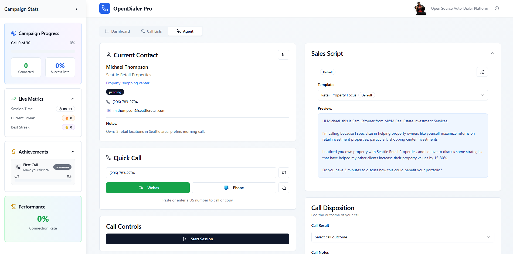

# 💸 OpenDialer Pro

_Auto-Dialer with support for both VoIP (SIP protocol via Cisco Webex) and cellular calls (Microsoft Phone Link integration)_



## Project Overview

OpenDialer Pro is a comprehensive web-based auto-dialer application built with React, TypeScript, and modern web technologies. It provides a complete solution for managing cold calling campaigns, contact lists, and agent workflows with support for both VoIP (SIP protocol via Cisco Webex) and cellular calls (Microsoft Phone Link integration).

## Architecture Overview

### Technology Stack
- **Frontend Framework**: React 18.3.1 with TypeScript
- **Build Tool**: Vite
- **UI Framework**: Tailwind CSS with shadcn/ui components
- **Routing**: React Router DOM
- **State Management**: React hooks with local state
- **Data Fetching**: TanStack React Query (v5.56.2)
- **Icons**: Lucide React
- **Charts**: Recharts (v2.12.7)
- **Form Handling**: React Hook Form with Zod validation
- **Notifications**: Sonner toast system

### Project Structure
```
src/
├── components/           # Reusable UI components
│   ├── ui/              # shadcn/ui base components
│   ├── AgentInterface.tsx        # Main agent calling interface (528 lines)
│   ├── CallListManager.tsx       # Contact list management (402 lines)  
│   ├── CampaignDashboard.tsx     # Campaign overview dashboard (258 lines)
│   └── AnalyticsDashboard.tsx    # Analytics and reporting
├── services/            # Business logic and data services
│   └── contactService.ts        # Contact management service
├── pages/              # Route components
│   └── Index.tsx       # Main application layout
├── hooks/              # Custom React hooks
└── lib/                # Utility functions
```

## Core Components Deep Dive

### 1. Contact Service (`src/services/contactService.ts`)

**Purpose**: Centralized service for managing contacts, call history, and campaign statistics.

**Key Interfaces**:
```typescript
interface Contact {
  id: string;
  name: string;
  phone: string;
  email: string;
  company: string;
  notes?: string;
  propertyType?: string;
  lastCalled?: Date;
  callCount: number;
  disposition?: string;
  status: 'pending' | 'contacted' | 'completed' | 'dnc';
  tags?: string[];
}

interface CallHistory {
  id: string;
  contactId: string;
  timestamp: Date;
  duration: number;
  disposition: string;
  notes: string;
  outcome: 'connected' | 'voicemail' | 'no-answer' | 'busy' | 'failed';
}
```

**Core Methods**:
- `getContacts(status?)`: Retrieve contacts with optional status filtering
- `getNextContact()`: Intelligent contact selection based on call count and last called date
- `updateContact(id, updates)`: Update contact information
- `logCall(contactId, disposition, notes, outcome, duration)`: Record call history
- `getStats()`: Generate real-time campaign statistics

**Sample Data**: Includes 5 pre-populated contacts with realistic commercial real estate data.

### 2. Agent Interface (`src/components/AgentInterface.tsx`)

**Purpose**: Primary interface for agents to make calls, manage dispositions, and send text messages.

**Key Features**:
- **Session Management**: Start/pause dialing sessions with statistics tracking
- **Call State Machine**: Handles dialing → connected → disposition → cooldown workflow
- **Text Templates**: Dynamic SMS templates for follow-up messages
- **Call Disposition Tracking**: 8 different disposition types
- **Cooldown Timer**: 30-second pause between calls for note-taking

**State Management**:
```typescript
const [isDialing, setIsDialing] = useState(false);
const [callActive, setCallActive] = useState(false);
const [cooldownTimer, setCooldownTimer] = useState(0);
const [sessionActive, setSessionActive] = useState(false);
const [currentContact, setCurrentContact] = useState<Contact | null>(null);
```

**Call Flow**:
1. Agent starts session
2. System loads next contact via `contactService.getNextContact()`
3. Agent initiates call (simulated with random connection probability)
4. If no answer/voicemail → Text templates appear
5. Agent selects disposition and adds notes
6. Call is logged to `contactService.logCall()`
7. Next contact is automatically loaded

**Text Message Templates**:
- Dynamically personalized with contact name and property type
- Three variations: Standard Introduction, Brief Follow-up, Value Proposition
- Copy-to-clipboard functionality for Microsoft Phone Link integration

### 3. Campaign Dashboard (`src/components/CampaignDashboard.tsx`)

**Purpose**: Real-time overview of campaign performance and contact status.

**Key Metrics**:
- Total Contacts with pending/contacted breakdown
- Calls Today with connection rate
- Connection Rate percentage
- Do Not Call exclusions

**Real-time Updates**: Refreshes statistics every 5 seconds via `useEffect` interval.

**Campaign Management**: 
- Displays mock campaigns with status (active/paused/completed)
- Progress tracking with completion percentages
- Dialing mode indicators (predictive/adaptive/preview)

### 4. Call List Manager (`src/components/CallListManager.tsx`)

**Purpose**: Comprehensive contact list management with import/export capabilities.

**Import Features**:
- CSV file upload with drag-and-drop
- Clipboard paste functionality
- Intelligent column mapping for various CSV formats
- Supports columns: Name, Phone, Email, Company, Property Type, Notes

**Export Features**:
- CSV export with all contact data
- Includes call history and disposition information
- Timestamped filenames

**Search & Filtering**:
- Real-time search across name, company, phone, email
- Status-based filtering (pending, contacted, completed, dnc)
- Contact count statistics

**CSV Parsing Logic**:
```typescript
const parseCsvData = (csvData: string): Partial<Contact>[] => {
  const lines = csvData.trim().split('\n');
  const headers = lines[0].split(',').map(h => h.trim().toLowerCase());
  // Intelligent mapping of common column names to Contact fields
}
```

### 5. Analytics Dashboard (`src/components/AnalyticsDashboard.tsx`)

**Purpose**: Detailed reporting and performance analytics (read-only component).

## Data Flow Architecture

### Contact Lifecycle
1. **Import**: CSV → `parseCsvData()` → `ContactService`
2. **Queue**: `getNextContact()` prioritizes by call count and last called date
3. **Calling**: Agent interface manages call state transitions
4. **Disposition**: Call outcome logged via `logCall()`
5. **Analytics**: Real-time statistics aggregation

### State Management Pattern
- **Service Layer**: `ContactService` acts as single source of truth
- **Component State**: Local React state for UI interactions
- **Real-time Sync**: Periodic refresh intervals for dashboard updates

## Key Workflows

### 1. Daily Contact Import Workflow
```
CSV File/Clipboard → parseCsvData() → Validation → ContactService.addContacts() → UI Refresh
```

### 2. Agent Calling Workflow
```
Start Session → Load Contact → Display Script → Dial → Handle Outcome → Log Disposition → Next Contact
```

### 3. Text Message Follow-up Workflow
```
No Answer/Voicemail → Show Templates → Copy to Clipboard → Microsoft Phone Link → Send SMS
```

## Component Dependencies

### External Dependencies
- **UI Components**: All shadcn/ui components (44 packages)
- **Icons**: lucide-react (462 icons available)
- **Forms**: react-hook-form + @hookform/resolvers
- **Validation**: zod schema validation
- **Charts**: recharts for analytics visualization
- **Notifications**: sonner for toast messages

### Internal Dependencies
```
Index.tsx
├── CampaignDashboard.tsx → contactService
├── CallListManager.tsx → contactService
├── AgentInterface.tsx → contactService
└── AnalyticsDashboard.tsx (read-only)
```

## Configuration & Setup

### Development Environment
```bash
npm install          # Install dependencies
npm run dev         # Start development server (Vite)
npm run build       # Production build
npm run preview     # Preview production build
```

### Key Configuration Files
- `vite.config.ts`: Build configuration
- `tailwind.config.ts`: Tailwind CSS customization
- `tsconfig.json`: TypeScript compiler options
- `components.json`: shadcn/ui configuration

## Simulation & Mock Data

### Call Simulation Logic
- **Connection Probability**: 70% success rate
- **Dialing Delay**: 2-5 seconds realistic timing
- **Call Duration**: Tracked for reporting
- **Disposition Outcomes**: 8 predefined types

### Sample Data Sets
- **Contacts**: 5 commercial real estate contacts
- **Campaigns**: 3 mock campaigns with different statuses
- **Property Types**: Retail, office, warehouse, mixed-use

## Integration Points

### Planned Integrations
1. **Cisco Webex**: SIP protocol for VoIP calls
2. **Microsoft Phone Link**: Cellular call routing
3. **FreeSWITCH/Asterisk**: Open-source telephony backend
4. **Docker**: Containerized deployment

### Current Limitations
- **Frontend-only**: No backend API integration
- **Simulated Calls**: No actual telephony connections
- **Local Storage**: No persistent data storage
- **Mock Data**: Pre-populated sample contacts

## Performance Considerations

### Large File Handling
- **CSV Import**: Processes large contact lists efficiently
- **Search Performance**: Real-time filtering with debouncing
- **Memory Management**: Contact data held in memory service

### UI Responsiveness
- **Lazy Loading**: Components load on-demand
- **Optimistic Updates**: Immediate UI feedback
- **Error Boundaries**: Graceful error handling

## Future Enhancement Areas

### Backend Integration
- Database persistence (PostgreSQL/MySQL)
- REST API for contact management
- Real-time WebSocket connections
- Authentication & authorization

### Telephony Integration
- SIP.js for WebRTC calling
- Asterisk/FreeSWITCH integration
- Call recording capabilities
- IVR system integration

### Advanced Features
- Predictive dialing algorithms
- CRM system integrations
- Advanced analytics & reporting
- Multi-tenant support

## Code Quality & Patterns

### TypeScript Usage
- Strict type checking enabled
- Interface-driven development
- Proper error handling patterns

### React Patterns
- Functional components with hooks
- Custom hooks for reusable logic
- Proper dependency arrays in useEffect
- Error boundary implementation

### Performance Optimizations
- Component memoization where appropriate
- Efficient re-rendering patterns
- Proper cleanup in useEffect hooks

## Testing & Debugging

### Console Logging
- Extensive console.log statements for debugging
- Call flow tracking
- Error state monitoring

### Error Handling
- Toast notifications for user feedback
- Graceful degradation for missing data
- Input validation with user-friendly messages

This documentation provides a comprehensive technical overview for AI agents to understand, modify, and extend the OpenDialer Pro application architecture.
